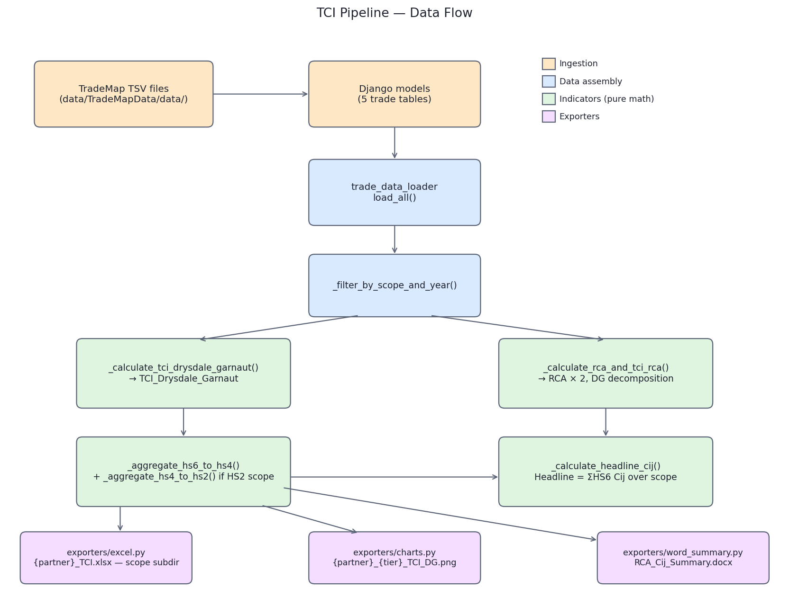

# Design and Data Flow

Developer-facing description of how the TCI pipeline is wired together. For
the economic methodology see [`methodology_for_economists.md`](methodology_for_economists.md);
for the validation procedure see [`validation_methodology.md`](validation_methodology.md).

---

## Module Map

```
loadFiles/
├── views.py                          HTTP endpoints
├── models.py                         6 Django models (incl. HSSITCConcordance)
├── management/commands/              CLI tools (validation + build_cee_aggregate, load_hs_sitc_concordance)
├── tests/                            Validation test suite
└── services/
    ├── ComtradeDownload.py           Comtrade API client (standalone)
    ├── TradeMapLoader.py             TSV → DB ingestion
    ├── scope.py                      Scope dataclass + SCOPE_ICT / SCOPE_STRATEGIC / SCOPE_YANG
    ├── trade_data_loader.py          DB → long-format frames + canonical HS4/HS2/SITC totals; drops restricted codes
    ├── TCICalculator.py              Pure math; orchestrates pipeline (scope-parameterised)
    └── exporters/
        ├── _filter.py                Shared scope filter (Country + primary-tier code)
        ├── excel.py                  Per-partner workbook (Country / [HS2] / [SITC] / HS4 / HS6 / World Reference)
        ├── charts.py                 Primary-tier time-series PNGs
        └── word_summary.py           RCA_Cij_Summary.docx (tier-aware, 3 Cij forms)
```

Concern separation:

| File | Job | Touches DB? | Touches matplotlib? | Touches python-docx? |
|---|---|---|---|---|
| `TradeMapLoader.py` | Parse TSV, write rows | yes | no | no |
| `trade_data_loader.py` | Query and join | yes (read) | no | no |
| `TCICalculator.py` | RCA, Cij, aggregation | no | no | no |
| `exporters/excel.py` | xlsx output | no | no | no |
| `exporters/charts.py` | PNG output | no | yes | no |
| `exporters/word_summary.py` | docx output | no | no | yes |

`TCICalculator.run()` is the only orchestrator. Math methods inside it never
import I/O libraries.

---

## End-to-End Flow



The same flow in text form:

The pipeline is parameterised by a `Scope` (`scope.py`): `SCOPE_ICT` (HS4
primary tier), `SCOPE_STRATEGIC` (HS2), `SCOPE_YANG` (SITC, china→CEE). Steps
below are scope-agnostic; the primary tier and output folder come from the scope.

1. **Ingestion** — TradeMap TSV files in `data/TradeMapData/data/` are parsed by
   `TradeMapLoader.load()` and upserted into six Django models. Processed files
   are moved to `data/TradeMapData/data/archive/`.

2. **Data assembly** — `trade_data_loader.load_all(partner_names=...)` queries the
   trade tables, extracts TOTAL rows as per-year denominators, drops TOTAL rows
   then **drops restricted codes** (`_drop_restricted_codes`, e.g. 8524 pre-2022)
   from every product-level frame so numerator and denominators share one code
   universe, precomputes reporter-independent canonical **HS4, HS2 and SITC**
   world/partner/reporter totals, and merges into one long-format frame per
   partner. One row per `(reporter, year, HS6 product)`. Returns a
   `LoadedTradeData` bundle.

3. **Scope filter** — `_filter_by_scope_and_year()` keeps HS6 codes whose first
   `scope.filter_digits` characters are in `scope.filter_codes` (empty = whole
   HS6 universe, for Yang) and years 2001–2024.

4. **HS6 indicators** — per HS6 row:
   - `_calculate_tci_drysdale_garnaut()` → `TCI_Drysdale_Garnaut`
   - `_calculate_rca_and_tci_rca()` → `RCA Reporter Export`, `RCA Partner Import`,
     `TCI_RCA_DG_Decomposition` (internal cross-check), `Active_Pair` flag

5. **Tier aggregation** — `_aggregate_hs6_to_hs4()` (+ `_aggregate_hs4_to_hs2()`
   for strategic, `_aggregate_to_sitc()` for Yang) builds per (reporter, year, tier):
   - **Cij DG-sum** (weighted, primary, additive) = **sum** of HS6 `TCI_Drysdale_Garnaut`
   - **Cij DG weighted-average** = `TCI_DG × (T / T_K)` = `Σ (T_k/T_K)·RCA_x·RCA_m`
     (heading-level world denominator; comparable across tiers, not additive)
   - tier RCA = canonical-source tier totals via Balassa (`RCA_Export_*`, `RCA_Import_*`)
   - **Cij RCA product** (unweighted) = `RCA_Export_* × RCA_Import_*`

6. **Headline** — `_calculate_headline_cij()` per (reporter, year): `Headline_Cij_DG`
   (sum of HS6 Cij over scope), `Headline_Cij_DG_WeightedAvg`, `Headline_Cij_RCA_Product`.

7. **Verify + export** — `_verify_partner_invariants()` guards RCA constancy and
   tier additivity, then exporters consume the indicator frames:
   - `export_excel(...)` → `{partner}_TCI.xlsx`, sheets `Country Summary`,
     (`SITC`/`HS2` if present), `HS4 Summary`, `HS6 Detail`, `World Reference`
     (deduplicated T_k / T_K / T per HS6×year)
   - `export_hs4_tci_charts(...)` → one PNG per (partner, primary-tier code)
   - `export_word_summary(...)` → `RCA_Cij_Summary.docx` (tier-aware method section
     + one table per reporter × primary-tier code; three Cij forms per partner —
     DG-sum, DG weighted-average, RCA product)

   Each exporter accepts optional `countries` and `hs4_codes` filters via
   `exporters._filter.filter_scope`; the filter does **not** affect the headline
   sheet (always the full scope) or the World Reference sheet.

---

## State Held on the `TCICalculator` Instance

| Attribute | Built by step | Shape (rows) | Used by |
|---|---|---|---|
| `hs6_trade_data_by_partner`     | 2, 3 | partner × HS6 × reporter × year | steps 4–6 |
| `hs6_with_indicators_by_partner`| 5    | adds Cij/RCA columns           | step 7 (Excel HS6 + World Reference sheets) |
| `hs4_index_by_partner`          | 5    | partner × HS4 × reporter × year | step 7 (Excel HS4 sheet, charts, Word) |
| `hs2_index_by_partner`          | 5    | partner × HS2 × reporter × year (strategic; empty otherwise) | step 7 (Excel HS2 sheet) |
| `sitc_index_by_partner`         | 5    | partner × SITC × reporter × year (Yang; empty otherwise) | step 7 (Excel SITC sheet), `validate_against_yang` |
| `headline_cij_by_partner`       | 6    | partner × reporter × year       | step 7 (Excel Country Summary) |

All are dicts keyed by partner name (`"China"`, `"US"`, or `"CCE"` for Yang).

---

## Three-Tier Numerical Invariants

Maintained by construction; verified at runtime.

| Invariant | Where |
|---|---|
| HS6: `TCI_Drysdale_Garnaut == TCI_RCA_DG_Decomposition` | algebraic equality, two independent code paths in `_calculate_*` |
| HS4 Cij-sum = sum of HS6 Cij | groupby `sum` in `_aggregate_hs6_to_hs4` |
| Headline Cij = sum of HS6 Cij over scope = sum of HS4 Cij-sum | groupby `sum` in `_calculate_headline_cij` |
| Tier RCA reporter-/partner-invariant; numerator and denominators share one code universe (restricted codes dropped in the loader) | `_verify_partner_invariants` + `PartnerInvariantsTest` |

The **Cij DG-sum** is the additive, headline-consistent form. The **Cij
weighted-average** (`TCI_DG_WeightedAvg`) is *not* additive — it is a per-tier
comparability measure, so it deliberately does not sum to the headline. A change
that breaks any sum/additivity invariant signals a regression.

---

## Entry Points

| Use case | Path |
|---|---|
| HTTP — calculate TCI | `POST /loadFiles/calculate_tci` (`views.py` → `TCICalculator().run(...)`; body `scope` = `ict`/`strategic`/`all`) |
| HTTP — load TSV files into DB | `GET /loadFiles/load_trade_data_to_db` (`views.py` → `TradeMapLoader().load()`) |
| Shell — ICT | `... TCICalculator().run()` |
| Shell — strategic | `... TCICalculator(scope=SCOPE_STRATEGIC).run()` |
| Shell — Yang china→CEE | `... TCICalculator(scope=SCOPE_YANG, partner_names=('CCE',)).run()` |
| Test — RCA correctness | `python manage.py test loadFiles.tests.RCAFormulaValidationTest` |
| Test — partner invariants | `python manage.py test loadFiles.tests.PartnerInvariantsTest` |
| Test — Comtrade data integrity | `python manage.py test loadFiles.tests.ComtradeDataIntegrityTest` |

---

## Adding a New Output Format

Pattern: write a function in `loadFiles/services/exporters/` that takes the
indicator dicts plus `(export_dir, countries, hs4_codes, logger)`, do the
filtering via `_filter.filter_scope`, and write to disk. Export the function
from `exporters/__init__.py`. Add a thin delegating method on `TCICalculator`
and call it from `run()`.

The existing three exporters (`excel.py`, `charts.py`, `word_summary.py`) are
templates — each is self-contained and depends only on its specific output
library.

---

## Regenerating the Flow Diagram

```bash
conda run -n Econometrics_Deps python docs/pipeline_flow.py
```

The script writes `docs/pipeline_flow.png`. Source is checked in so the diagram
stays in sync with the modules it describes.
